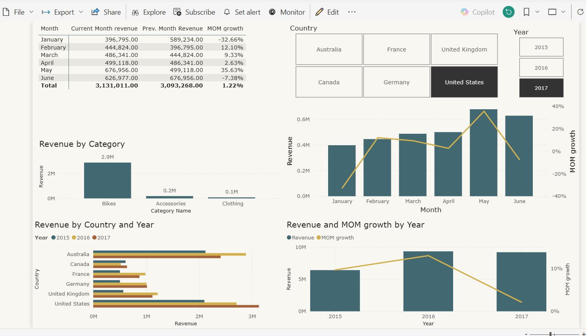
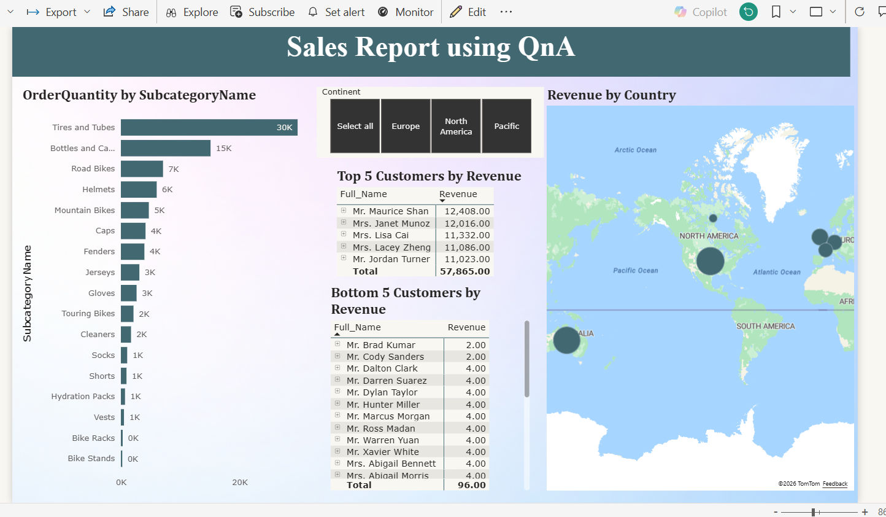
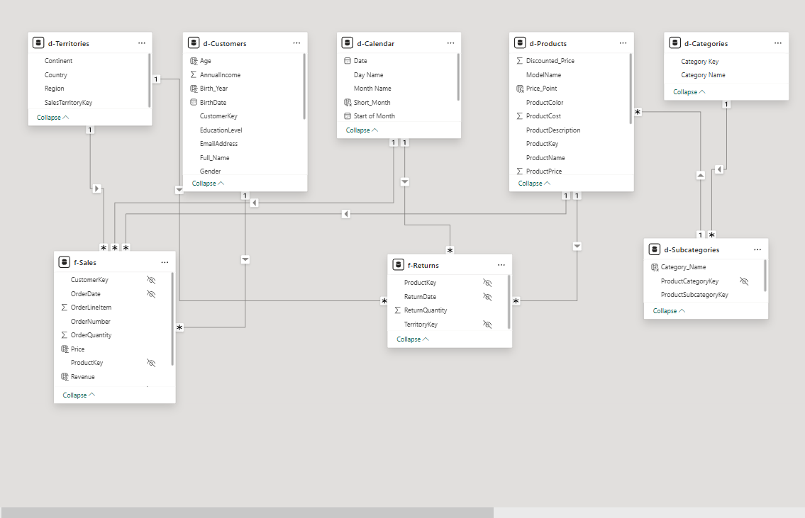
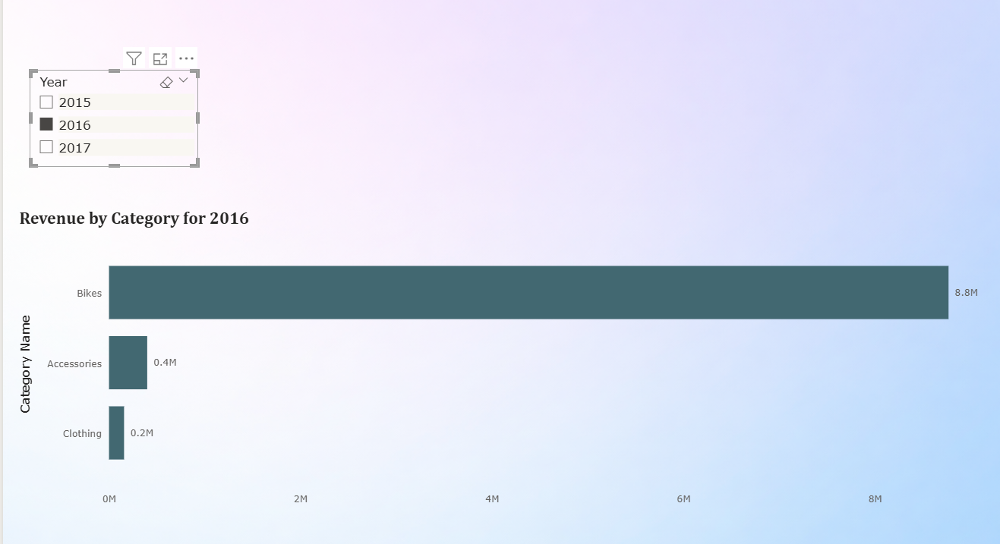

# Sales Analytics Dashboard – AdventureWorks

## Project Overview
This Power BI dashboard analyzes revenue performance for AdventureWorks across multiple countries (USA, Canada, France, Germany, and Australia) for the years 2015–2017.

The dashboard provides insights into product categories including Bikes, Clothing, and Accessories, along with their respective subcategories.

---

## Tools Used
- Power BI
- Power Query
- Data Modeling
- DAX
- Excel / CSV datasets

---

## Dashboard Preview

### Dashboard Overview

### Country Wise Revenue Analysis

### Customer Sales Report

### Data Model

### Product Drill Through Analysis

### Revenue by Category

---

## Key Insights
- Bikes generate the highest revenue among all product categories.
- The United States contributes the largest share of overall sales.
- Sales show consistent growth across 2015–2017.
- Drill-through analysis helps understand product-level performance.

---

## Dataset
AdventureWorks Sales Dataset

